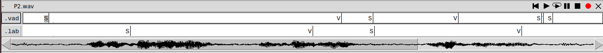

PAV - P2: detección de actividad vocal (VAD)
============================================
*Àlex Mateo, David Serrano i Francesc Net*

Esta práctica se distribuye a través del repositorio GitHub [Práctica 2](https://github.com/albino-pav/P2),
y una parte de su gestión se realizará mediante esta web de trabajo colaborativo.  Al contrario que Git,
GitHub se gestiona completamente desde un entorno gráfico bastante intuitivo. Además, está razonablemente
documentado, tanto internamente, mediante sus [Guías de GitHub](https://guides.github.com/), como
externamente, mediante infinidad de tutoriales, guías y vídeos disponibles gratuitamente en internet.


Inicialización del repositorio de la práctica.
----------------------------------------------

Para cargar los ficheros en su ordenador personal debe seguir los pasos siguientes:

*	Abra una cuenta GitHub para gestionar esta y el resto de prácticas del curso.
*	Cree un repositorio GitHub con el contenido inicial de la práctica (sólo debe hacerlo uno de los
	integrantes del grupo de laboratorio, cuya página GitHub actuará de repositorio central):
	-	Acceda la página de la [Práctica 3](https://github.com/albino-pav/P2).
	-	En la parte superior derecha encontrará el botón **`Fork`**. Apriételo y, después de unos segundos,
		se creará en su cuenta GitHub un proyecto con el mismo nombre (**P2**). Si ya tuviera uno con ese 
		nombre, se utilizará el nombre **P2-1**, y así sucesivamente.
*	Habilite al resto de miembros del grupo como *colaboradores* del proyecto; de este modo, podrán
	subir sus modificaciones al repositorio central:
	-	En la página principal del repositorio, en la pestaña **:gear:`Settings`**, escoja la opción 
		**Collaborators** y añada a su compañero de prácticas.
	-	Éste recibirá un email solicitándole confirmación. Una vez confirmado, tanto él como el
		propietario podrán gestionar el repositorio, por ejemplo: crear ramas en él o subir las
		modificaciones de su directorio local de trabajo al repositorio GitHub.
*	En la página principal del repositorio, localice el botón **Branch: master** y úselo para crear
	una rama nueva con los primeros apellidos de los integrantes del equipo de prácticas separados por
	guion (**fulano-mengano**).
*	Todos los miembros del grupo deben realizar su copia local en su ordenador personal.
	-	Copie la dirección de su copia del repositorio apretando en el botón **Clone or download**.
		Asegúrese de usar *Clone with HTTPS*.
	-	Abra una sesión de Bash en su ordenador personal y vaya al directorio **PAV**. Desde ahí, ejecute:

		```.sh
		git clone dirección-del-fork-de-la-práctica
		```

	-	Vaya al directorio de la práctica `cd P2`.
	-	Cambie a la rama **fulano-mengano** con la orden:

		```.sh
		git checkout fulano-mengano
		```

*	A partir de este momento, todos los miembros del grupo de prácticas pueden trabajar en su directorio
	local del modo habitual.
	-	También puede utilizar el repositorio remoto como repositorio central para el trabajo colaborativo
		de los distintos miembros del grupo de prácticas; o puede serle útil usarlo como copia de seguridad.
	-	Cada vez que quiera subir sus cambios locales al repositorio GitHub deberá confirmar los
		cambios en su directorio local:

		```.sh
		git add .
		git commit -m "Mensaje del commit"
		```

		y, a continuación, subirlos con la orden:

		```.sh
		git push -u origin fulano-mengano
		```

*	Al final de la práctica, la rama **fulano-mengano** del repositorio GitHub servirá para remitir la
	práctica para su evaluación utilizando el mecanismo *pull request*.
	-	Vaya a la página principal de la copia del repositorio y asegúrese de estar en la rama
		**fulano-mengano**.
	-	Pulse en el botón **New pull request**, y siga las instrucciones de GitHub.


Entrega de la práctica.
-----------------------

Responda, en este mismo documento (README.md), los ejercicios indicados a continuación. Este documento es
un fichero de texto escrito con un formato denominado _**markdown**_. La principal característica de este
formato es que, manteniendo la legibilidad cuando se visualiza con herramientas en modo texto (`more`,
`less`, editores varios, ...), permite amplias posibilidades de visualización con formato en una amplia
gama de aplicaciones; muy notablemente, **GitHub**, **Doxygen** y **Facebook** (ciertamente, :eyes:).

En GitHub. cuando existe un fichero denominado README.md en el directorio raíz de un repositorio, se
interpreta y muestra al entrar en el repositorio.

Debe redactar las respuestas a los ejercicios usando Markdown. Puede encontrar información acerca de su
sintáxis en la página web [Sintaxis de Markdown](https://daringfireball.net/projects/markdown/syntax).
También puede consultar el documento adjunto [MARKDOWN.md](MARKDOWN.md), en el que se enumeran los elementos
más relevantes para completar la redacción de esta práctica.

Recuerde realizar el *pull request* una vez completada la práctica.

Ejercicios
----------

### Etiquetado manual de los segmentos de voz y silencio

- Etiquete manualmente los segmentos de voz y silencio del fichero grabado al efecto. Inserte, a 
  continuación, una captura de `wavesurfer` en la que se vea con claridad la señal temporal, el contorno de
  potencia y la tasa de cruces por cero, junto con el etiquetado manual de los segmentos.


**`Aquí podemos ver como hemos segmentado en silencio (S) y voz (V) la parte del audio.`**

- A la vista de la gráfica, indique qué valores considera adecuados para las magnitudes siguientes:

	* Incremento del nivel potencia en dB, respecto al nivel correspondiente al silencio inicial, para estar
      seguros de que un segmento de señal se corresponde con voz.
	
**`A partir de la gráfica podemos observar que el nivel correspondiente al silencio inicial es de aproximadamente de 45 dB. El nivel de potencia al hablar es de aproximadamente de 60dB por lo que sufre un incremento de potencia de 15dB.`**

	* Duración mínima razonable de los segmentos de voz y silencio.
**`La señal de voz consta de 3 silencios de aproximadamente 300ms y 3 series de palabras de aproximadamente 1s.`**

**`En la siguiente imagen se puede observar la representación del etiquetado utilizando el programa cat. Se puede observar la duración de los intervalos de cada segmento.`**


	* ¿Es capaz de sacar alguna conclusión a partir de la evolución de la tasa de cruces por cero?
**`Comparando la waveform con la tasa de cruces por cero podemos observar que dependiendo del tipo de fonema la tasa cambia. En nuestro caso la señal viene por la frase: "David Serrano Francesc Net". Podemos observar como la gráfica de cruces por cero tiene tres picos y esto es debido a la S de Serrano la primera c y s de Francesc, ya que son fricativas sordas. Dicho fonema (las fricativas sordas) son mas erraticas que el resto.`**


### Desarrollo del detector de actividad vocal

**`Antes de empezar con el desarrollo del detector de actividad vocal hemos hecho las tareas del pdf:`**

**`En las siguientes dos imágenes podemos observar dos paneles de transcripción, uno con la segmentación manual y otro con la segmentación generada por el programa vad.`**




**`Vemos que no funciona correctamente, ya que asigna el etiquetado aleatorio. Esto nos llevará al correcto desarrollo de la práctica, que veremos a continuación.`**

**`Hemos escrito y ejecutado el fichero meson.build para crear el programa en el directorio bin. Su funcionamiento es:`**


- Complete el código de los ficheros de la práctica para implementar un detector de actividad vocal tan
  exacto como sea posible. Tome como objetivo la maximización de la puntuación-F `TOTAL`.

**`En los siguientes apartados comentaremos el funcionamiento de la máquina de estados. Básicamente, tendremos 5 estados, el inicial, el de voz y el de sonido, y dos estados que serán quizás sonido y quizás voz y iremos a estos solo cuando haya un posible cambio de estado`**

- Inserte una gráfica en la que se vea con claridad la señal temporal, el etiquetado manual y la detección
  automática conseguida para el fichero grabado al efecto. 


**`En esta gráfica podemos observar como la señal es reconocida casi perfectamente por el VAD. Lo único que podemos observar, es que hay unos cuantos segmentos de voz a silencio donde la voz tarda un poco en irse. Esto es porqué en el programa, hemos puesto más estados de espera de maybe silence a silence, ya que el silencio, al ser bastante aleatorio dentro de un intervalo, es más complicado de determinar, y consecuentemente necesitamos más muestras para realmente hacer esta decisión. Con la voz no pasa lo mismo, ya que con varias tramas (muchas menos que con el silencio) detectamos una mejora considerable de la amplitud, con lo cual es más fácil determinar los cambios de estado. `**
**`Comentarios: Observamos un buen recall V, concretamente del 98%. Esto puede ser debido a lo comentado anteriormente, que al tener tan pocos estados de espera, a la que notamos un tramo donde aumenta la potencia, saltamos al estado de voz fácilmente. Por eso, baja bastante la precisión en comparación al silencio: Precisión V -> 91%, precisión S -> 98%. Para el silencio podemos observar que sucede exactamente lo contrario. Globalmente podemos observar que es una buena detección de audio y voz, dándonos una media de un 96.46% en global.`**


**`Hemos escojido una segunda gráfica, también, para remarcar que hay señales que nos hacen disminuir considerablemente la media. Eso es debido a que nosotros nos hemos definido unos parámetros para otras señales (la mayoria) que en estas no funcionan tan bien. Como se puede observar, es una señal bastante ruidosa y a veces silencio (S) y voz (V) se mezclan o le cuesta bastante hacer la transición entre estas. Aún así, no es tan crítico tener un 81% de media en esta ya que las demás rondamos los 93 aproximadamente. Comentar también, que tal y como podemos ver en las estadísticas, en este caso nos ha fallado bastante la detección de la voz, y la precisión a la vez de detectar el sonido, justo lo contrario a la tónica general, que comentaremos en el apartado siguiente.`**

**`En esta gráfica podemos ver que la máquina ha fallado más en hacer el etiquetado`**
- Explique, si existen. las discrepancias entre el etiquetado manual y la detección automática.

- Evalúe los resultados sobre la base de datos `db.v4` con el script `vad_evaluation.pl` e inserte a 
  continuación las tasas de sensibilidad (*recall*) y precisión para el conjunto de la base de datos (sólo
  el resumen).


### Trabajos de ampliación

#### Cancelación del ruido en los segmentos de silencio

- Si ha desarrollado el algoritmo para la cancelación de los segmentos de silencio, inserte una gráfica en
  la que se vea con claridad la señal antes y después de la cancelación (puede que `wavesurfer` no sea la
  mejor opción para esto, ya que no es capaz de visualizar varias señales al mismo tiempo).

#### Gestión de las opciones del programa usando `docopt_c`

- Si ha usado `docopt_c` para realizar la gestión de las opciones y argumentos del programa `vad`, inserte
  una captura de pantalla en la que se vea el mensaje de ayuda del programa.


**`Este es el mensaje que nos sale al ejecutar el programa. Si escribimos un help, nos explica los comandos posibles.`**

### Contribuciones adicionales y/o comentarios acerca de la práctica

- Indique a continuación si ha realizado algún tipo de aportación suplementaria (algoritmos de detección o 
  parámetros alternativos, etc.).

- Si lo desea, puede realizar también algún comentario acerca de la realización de la práctica que considere
  de interés de cara a su evaluación.


### Antes de entregar la práctica

Recuerde comprobar que el repositorio cuenta con los códigos correctos y en condiciones de ser 
correctamente compilados con la orden `meson bin; ninja -C bin`. El programa generado (`bin/vad`) será
el usado, sin más opciones, para realizar la evaluación *ciega* del sistema.
